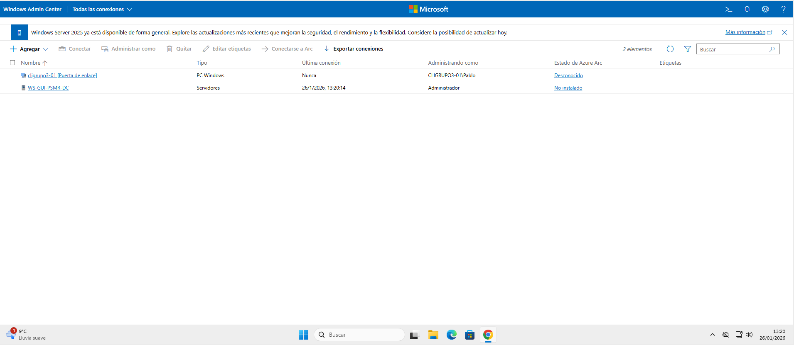
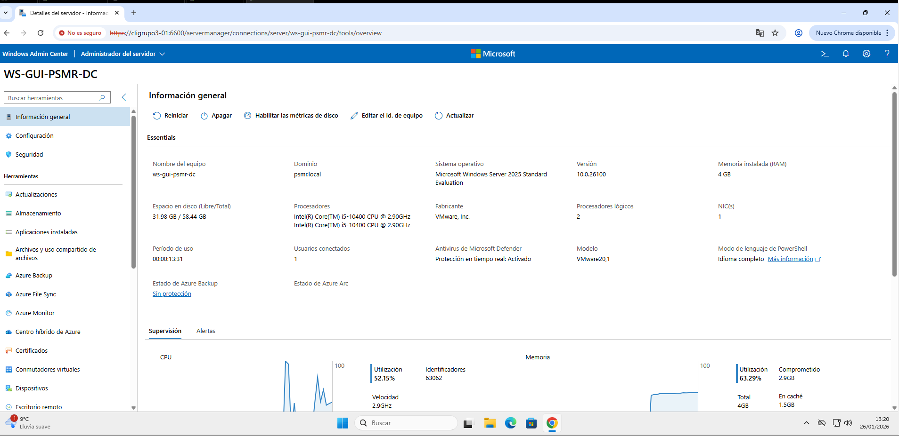
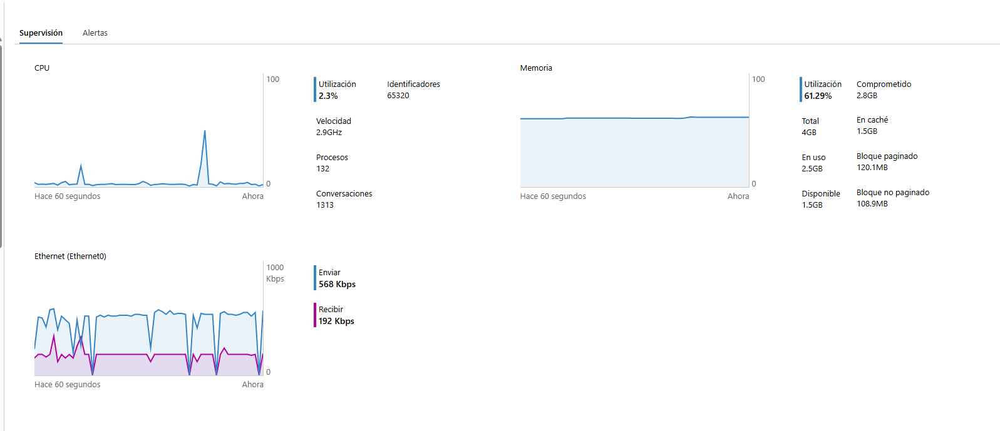
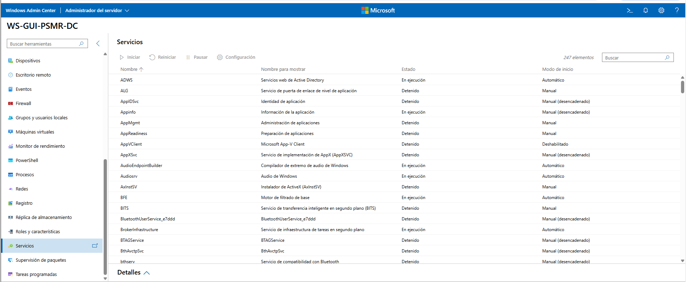
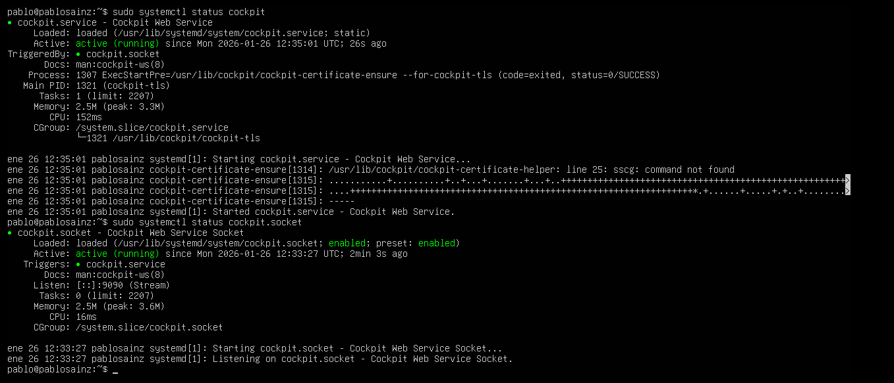
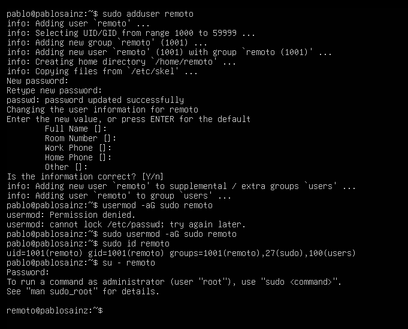
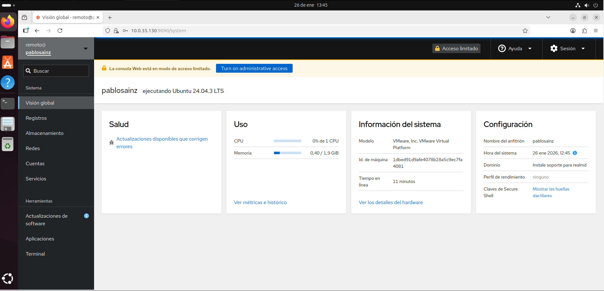
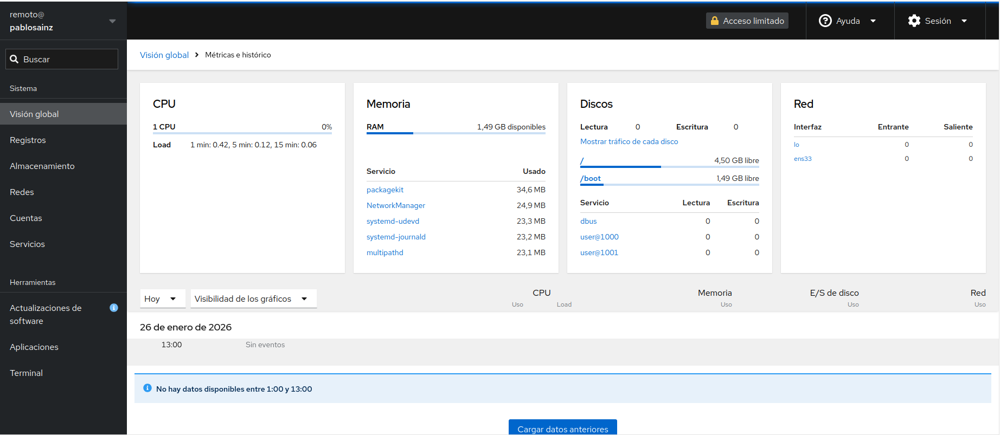

# UT4 - Administración remota con WAC (Windows Admin Center) y Cockpit

## Documentación de WAC (Windows Admin Center)
WAC o Windows Admin Center es el programa desarrollado por Microsoft para poder usar herramientas de monitorización como revisar los servicios y procesos que se están ejecutando en el momento, o el uso de CPU y memoria vía interfaz web de forma remota.
### 1. Acceso a WAC 
Para usar correctamente WAC, hay que instalarlo dentro de Windows 11 para usarlo como puente hacia el servidor en Windows Server. En la configuración rápida, nos dará un puerto (generalmente el puerto 6600) para poder acceder por la interfaz web. Una vez accedamos a la interfaz principal de WAC, tenemos que tener a mano un usuario que tenga permisos de acceso remoto o el usuario administrador, ya que necesitaremos sus credenciales para conectarnos.

### 2. Administración remota del servidor
Cuando nos hayamos conectado al servidor, se muestra en la página principal la información básica de los componentes del servidor y la información general del servidor.

Aquí vemos qué uso de CPU y RAM hay en el servidor.

Entre diversas herramientas, podemos encontrar los servicios que se encuentran en el servidor y así poder revisar el estado de los servicios en caso de fallo o de requerir un reinicio.

| Sistema administrado | Herramienta | Protocolo | Puerto |
|:----------------------:|:-------------:|:-----------:|:--------:|
| Windows Server 2025 |  WAC | HTTPS, WinRM, SMB, Kerberos | 6600 (HTTPS) 5985/5986 (WinRM) 445 (SMB) 88 (Kerberos) 

## Documentación de Cockpit
### 1. Estado del servicio de Cockpit y el socket
Para saber el estado del servicio y del socket, se ejecuta `sudo systemctl status cockpit` y `sudo systemctl status cockpit.socket`

### 2. Creación del usuario y añadir al grupo sudo
Necesitamos crear un usuario que se dedique específicamente a las tareas de monitorización remota. Para ello, creamos el usuario con el comando `sudo adduser remoto` y lo metemos al grupo *sudo* para que tenga permisos de **root** usando el comando `sudo usermod -aG sudo remoto`.

### 3. Accediendo a Cockpit desde el equipo cliente mediante navegador y se muestra la interfaz
**Para observar el rendimiento de Ubuntu Server, he usado Ubuntu Desktop, en vez de Windows 11, para tener mejor rendimiento del equipo.**

Una vez hayamos comprobado que el servicio está activo y hemos creado el usuario específico para monitorización remota, podemos acceder a la interfaz web introduciendo en la URL la **dirección IP del servidor** y el **puerto 9090**, cuyo puerto es el que establece para **HTTPS**. De forma que la URL queda: [https://10.0.35.130:9090](https://10.0.35.130:9090)

### 4. Rendimiento del servidor
Para revisar el uso de CPU y de memoria RAM, hay que dirigirse al apartado **Visión global**, donde podremos ver dichos usos e información del sistema.

| Sistema | Usuario remoto | Herramienta | Protocolo | Puerto |
|:---------:|:----------------:|:-------------:|:-----------:|:--------:|
| Ubuntu Server | Monitor | Cockpit | HTTPS | 9090 |