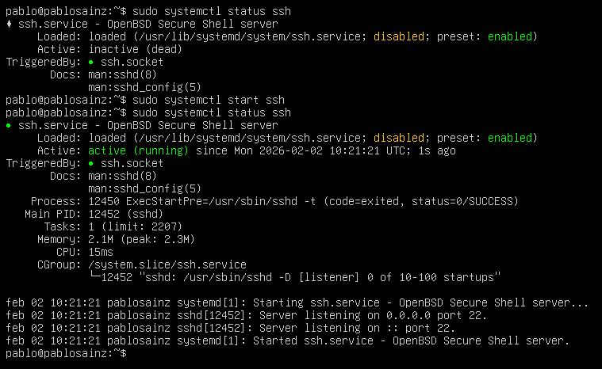
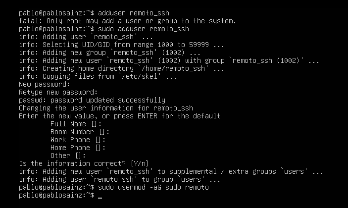
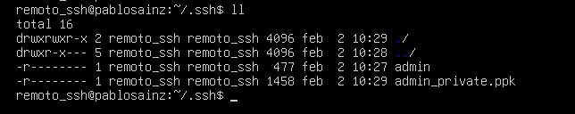
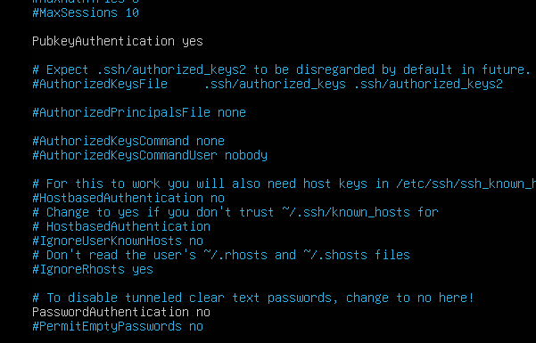
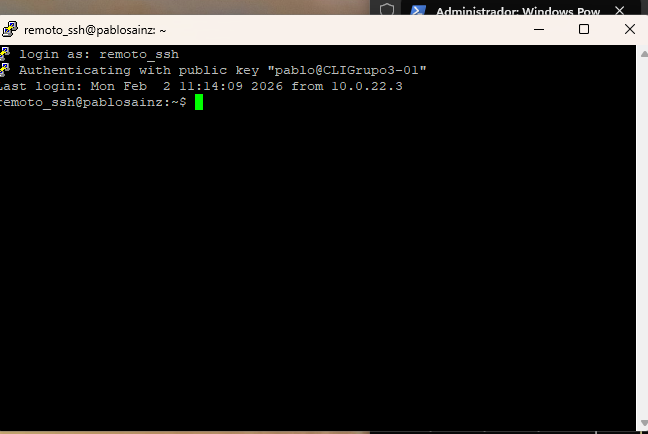
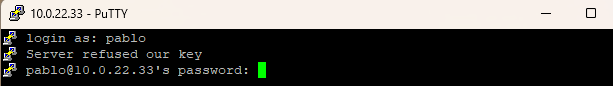
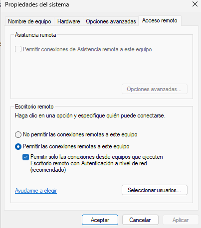
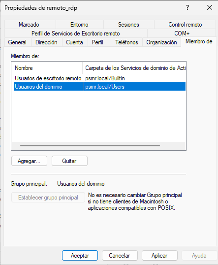
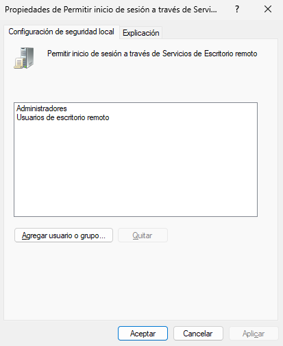
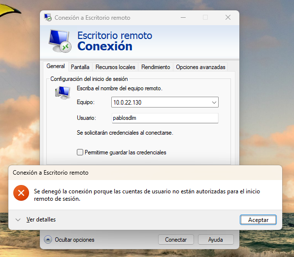

# Práctica 2: SSH y RDP
## Acceso SSH
- Usuario autorizado: remoto_ssh  
- Cliente: PuTTY  
- Autenticación: clave pública  
- Contraseña por SSH: deshabilitada  
- Usuarios no autorizados: acceso denegado  
### 1. Comprobación del servicio
Hay que comprobar que el servicio esté activo para poder usar SSH desde Putty en Windows 11

### 2. Creación del usuario remoto
Necesitamos crear un usuario que haga las funciones de administración remota con SSH sin tener que usar root

### 3. Claves dentro de .ssh
Para iniciar sesión con Putty, hay que generar un par de claves desde la consola de Windows 11 para convertirlas a una clave privada que Putty pueda entender para poder conectarse remotamente y enviar la clave pública al servidor usando **scp**.

### 4. Configuración de SSH
Dentro de la configuración de SSH, la configuración de contraseñas *PubkeyAuthentication* debe estar establecido en **yes** para que requiera clave privada para acceder al servidor y *PasswordAuthentication* debe estar en **no** para que no pida contraseña al acceder.

### 5. Inicio de sesión con el usuario remoto usando SSH
Si configuramos Putty con la clave con extensión **PPK** que ha generado la conversión del par de claves y accedemos remotamente al usuario remoto, podremos acceder.

### 6. Inicio de sesión con otro usuario
Si intentamos entrar con otro usuario al servidor de manera remota, dará error de acceso denegado.
**En el caso de esta captura, se muestra otro error debido a un error con SSH que, aunque SSH estuviese configurado para que solo pudiera recibir claves, este pedía contraseña igualmente**

## Acceso RDP
- Usuario RDP: remoto_rdp 
- Sistema administrado: Windows Server 2025  
- Protocolo: RDP  
- Grupo de acceso: Usuarios de Escritorio remoto  
- Cifrado: Sí  
### 1. Configurando Escritorio Remoto y la autenticación a nivel de red
Para poder acceder remotamente al servidor, hay que permitir el Escritorio Remoto desde el administrador del servidor. Dentro de la ventana para habilitar el servicio, hay que activar la Autenticación a nivel de red para que solo reconozca los clientes que están en la misma red. 

### 2. Creación del usuario remoto y agregarlo al grupo de Usuarios de Escritorio Remoto
Hay que crear un usurio remoto que haga las funciones administrativas. Para ello, hay que agregarle al grupo **Usuarios de escritorio remoto** para que pueda acceder remotamente.

### 3. Asignación de derechos para que el usuario pueda acceder remotamente
El grupo de **Usuarios de escritorio remoto** no está dentro de la política de seguridad local de **Permitir inicio de sesión a través de Servicios de Escritorio Remoto**, por lo que hay que añadirlo para que el usuario pueda acceder. Esta política se encuentra dentro de `Directivas de equipo locales > Directivas locales > Asignación de derechos de usuario > Permitir inicio de sesión a través de Servicios de Escritorio Remoto` y habría que añadir el grupo dentro de esta política.

### 4. Inicio de sesión con el usuario remoto
Para iniciar sesión remotamente al servidor, hay que abrir en un equipo cliente **Escritorio Remoto** e introducir la dirección IP del servidor o el nombre junto al usuario y contraseña del usuario remoto.

### 5. Inicio de sesión con otro usuario
Con un usuario que solo se encuentre en el grupo de **Usuarios de dominio**, nos dará un error de acceso denegado.

