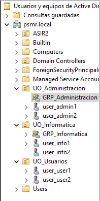
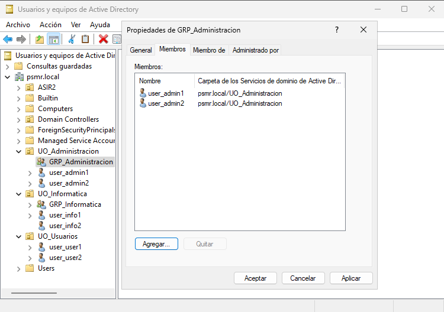
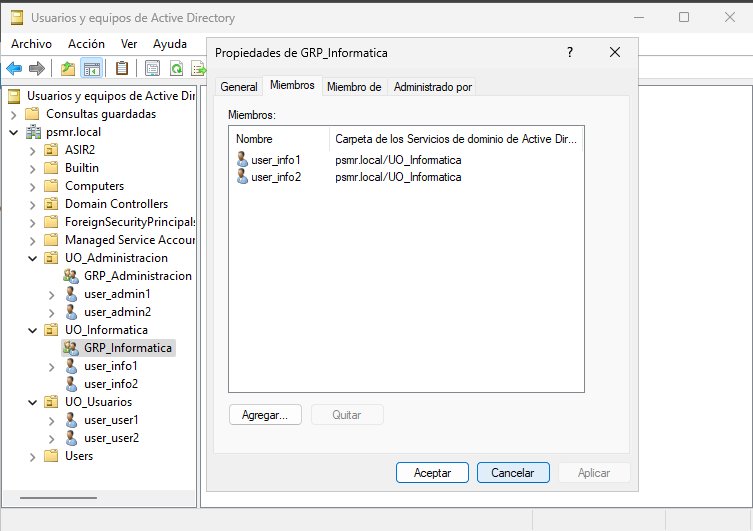
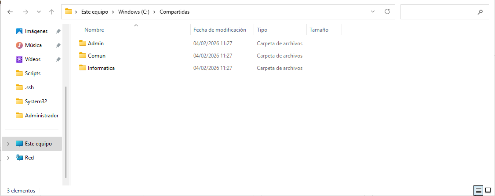
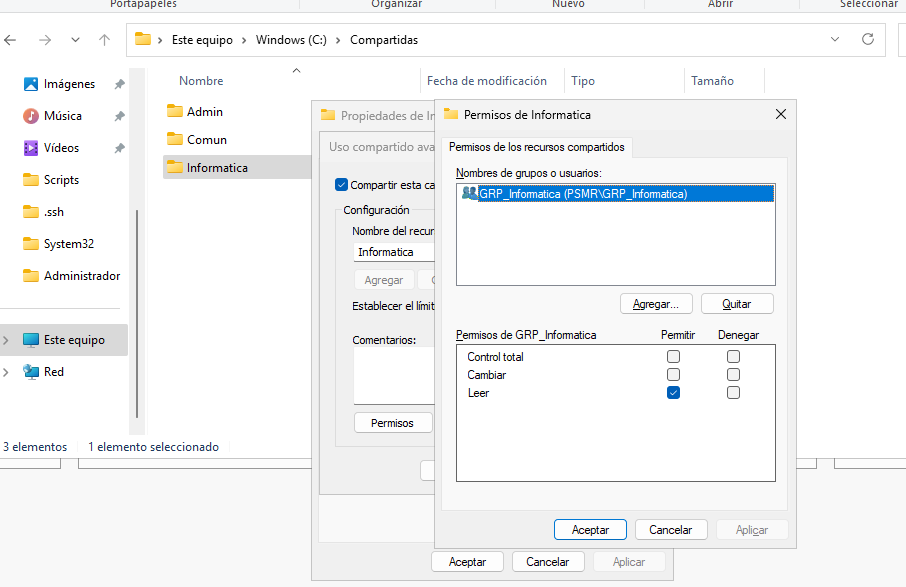

# Automatización de tareas
## Estructura del dominio
Esta es la estructura del dominio, que se compone de la siguiente manera:
| Unidad Organizativa | Grupo | Usuarios|
|:-------------------:|:-----:|:-------:|
| UO_Administracion | GRP_Administracion | user_admin1, user_admin2 |
| UO_Informatica | GRP_Informatica | user_info1, user_info2 |
| UO_Usuarios | No tiene grupo | user_user1, user_user2 |

## Tarea 1: Mapeo Automático de Unidades de Red

## 2. Script de limpieza automático