# Automatización de tareas
## Estructura del dominio
Esta es la estructura del dominio, que se compone de la siguiente manera:
| Unidad Organizativa | Grupo | Usuarios|
|:-------------------:|:-----:|:-------:|
| UO_Administracion | GRP_Administracion | user_admin1, user_admin2 |
| UO_Informatica | GRP_Informatica | user_info1, user_info2 |
| UO_Usuarios | No tiene grupo | user_user1, user_user2 |

Hay que añadir los usuarios al grupo de Administración para agrupar los usuarios de Administración

Hay que añadir los usuarios al grupo de Informática para agrupar los usuarios de Informática

## Tarea 1: Mapeo Automático de Unidades de Red
#### Estructura de carpetas

#### Permisos
Cuando entramos a las propiedades de una de las carpetas y entramos en **Uso compartido avanzado**, podemos seleccionar qué grupo queremos que vea esa carpeta. Le he dado los permisos de lectura y escritura para que ese grupo pueda crear, modificar y leer archivos. También le he dado permiso al administrador para que tenga control total.

Esta es la pestaña de seguridad:

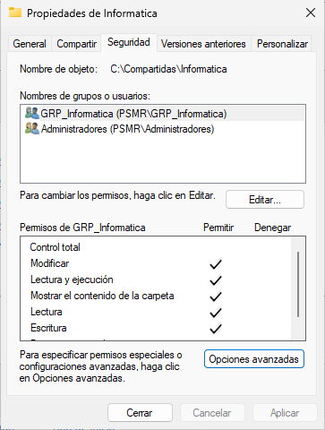

#### Creación de GPO
Se crea la GPO correspondiente para el mapeo de unidades y se vincula a las unidades organizativas para ordenar los permisos y aplicar configuraciones sin afectar a otros grupos y usuarios.
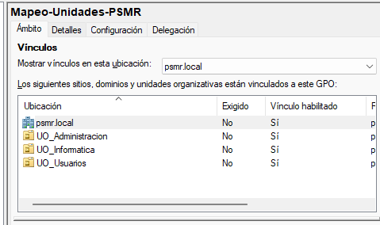

#### Mapeo de unidades configuradas

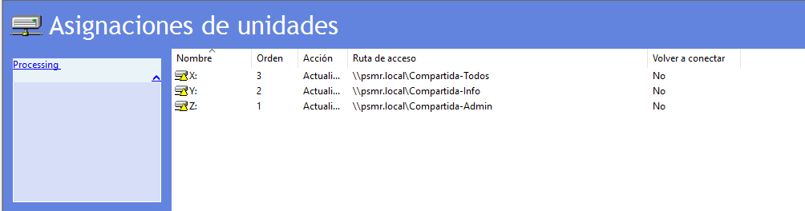

En la configuración de unidades, seleccionamos la ruta de red del servidor y el nombre de la carpeta como ubicación para que apunte a la carpeta que se va a compartir. Debemos asignar una letra para la unidad, en este caso, la Z:

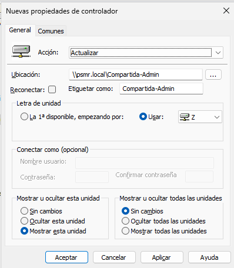

Para segmentar la unidad, debemos ir a la pestaña comunes y seleccionar un destinatario que va a ser el grupo de seguridad del grupo correspondiente a la carpeta, en este caso, **GRP_Administracion**.

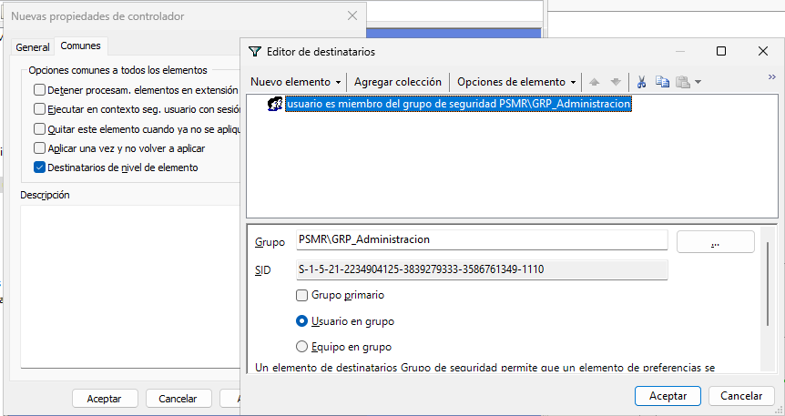
#### Muestra del explorador de archivos con los discos para cada usuario

Una vez están los discos configurados, entramos dentro de un usuario en un Windows 11 cliente y vemos que en el explorador de archivos aparecen las unidades que hemos configurado para cada grupo y la carpeta para todos los usuarios.
En esta captura vemos los recursos que aparecen para los usuarios que se encuentran dentro del grupo de administración.

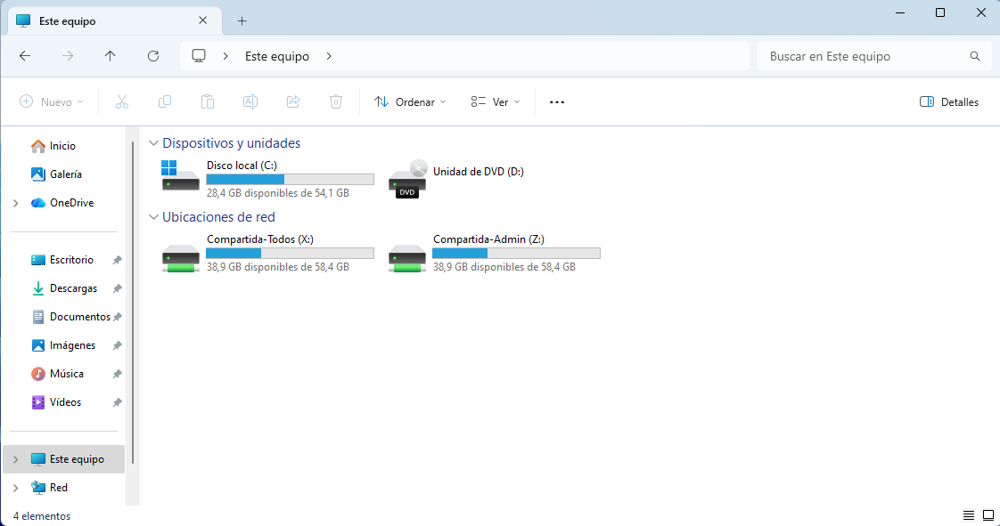

En esta captura, vemos los recursos que aparecen para los usuarios que se encuentran dentro del grupo de informática.

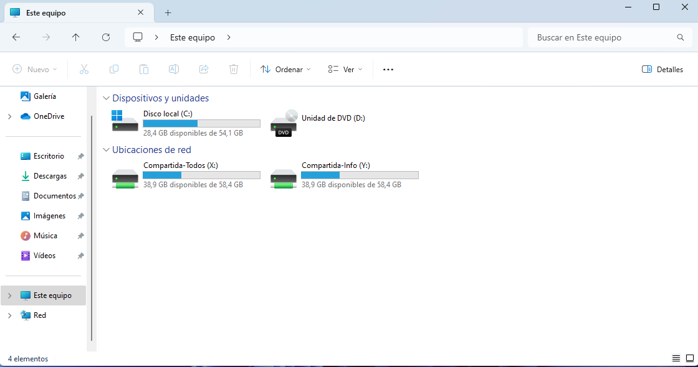
#### Acceso denegado para usuarios que no tienen permisos
El usuario1 del grupo Informática no tiene permisos, por lo que no podrá acceder a la carpeta. 
**Por alguna razón, el usuario es capaz de entrar dentro de la carpeta si la ruta es \\\\psmr.local\Compartida-Admin pero no muestra ningún contenido. Pero si se usa la dirección IP en vez del FQDN, si que da acceso denegado.**

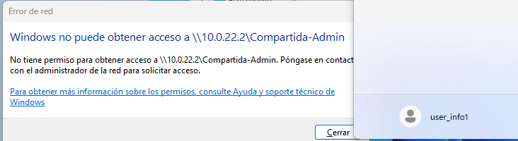
## 2. Script de limpieza automático
#### Creación de la GPO

Se crea una GPO vinculada a la unidad organizativa de Usuarios para ordenar la política y a quién se le va a aplicar

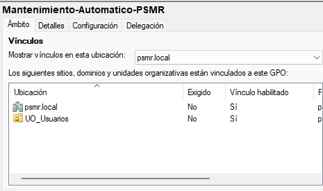
#### Configuración de la tarea

En la configuración general, seleccionamos que sea el usuario System el que ejecute la tarea con los permisos más altos.

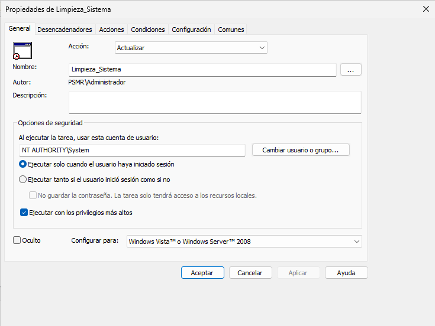

En las opciones del desencadenador, pondremos que se ejecute semanalmente cada domingo cuando el servidor tenga menos carga y no haya nadie trabajando.

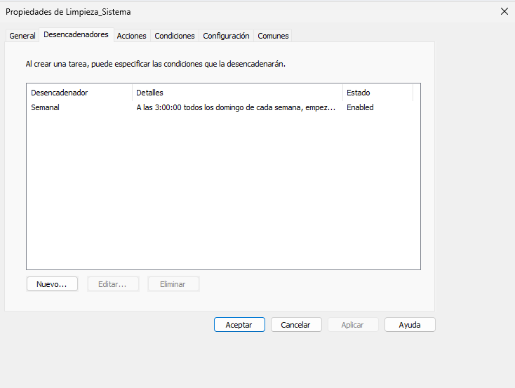

La acción que realizará la tarea será ejecutar un powershell con el script de limpieza, que vendrá con los parámetros **-executionpolicy bypass** para que ignore las restricciones de ejecución de scripts y **-file** para indicar la ruta del script.

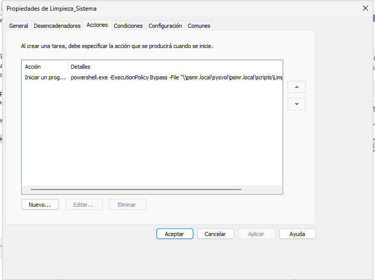
#### Tarea visible en el Programador de tareas del cliente

Dentro del programador de tareas del cliente, se tiene que ejecutar como administrador para poder ver la tarea, ya que con los permisos básicos, no aparece.

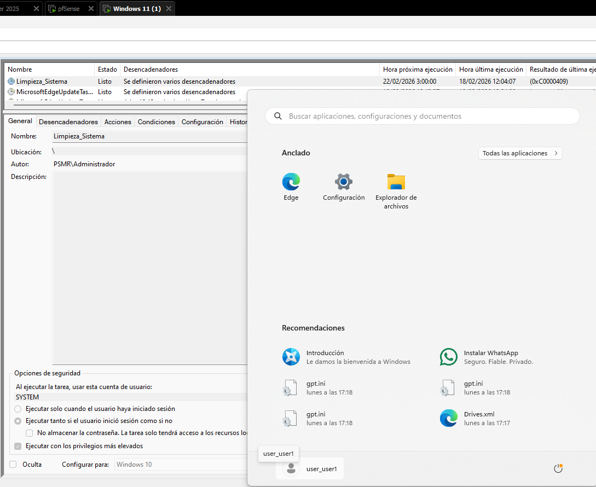
#### Ejecución exitosa

Como vemos en el historial de la tarea, dice **task completed** por lo que vemos que si se ha ejecutado la tarea.

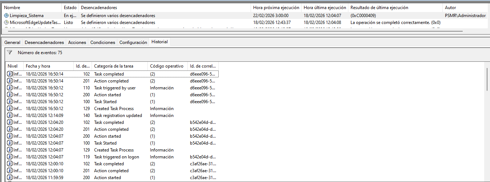
#### Contenido del log
Si vamos a **C:\Logs**, vemos principalmente que se ha creado el directorio y, a su vez, se ha generado un archivo con el log de la ejecución del script

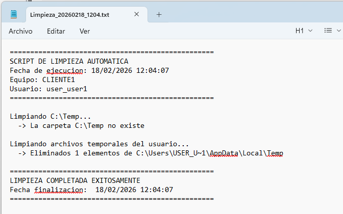
